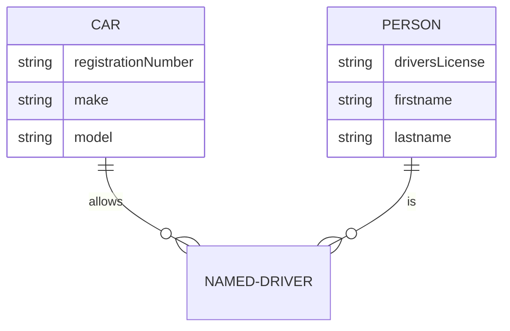
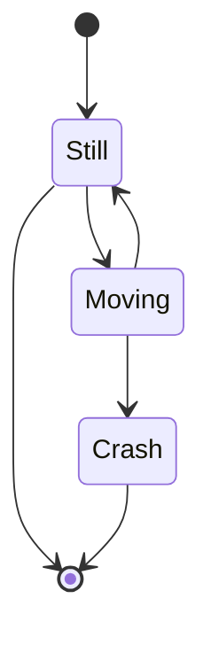
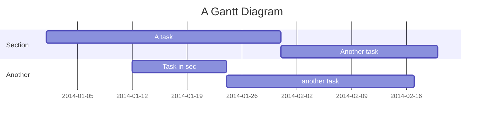
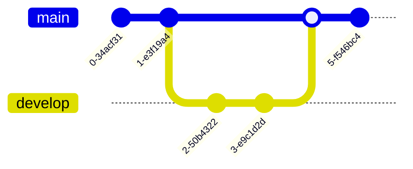

# Advanced Diagram Types

## Entity Relationship (ER)
Used for database schemas.

## State Diagram
State machines and transitions.

## Gantt Chart
Project planning.

## Git Graph
Visualize git history.

