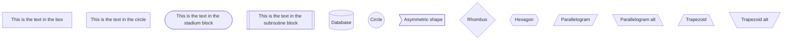
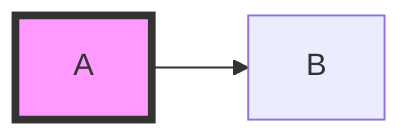
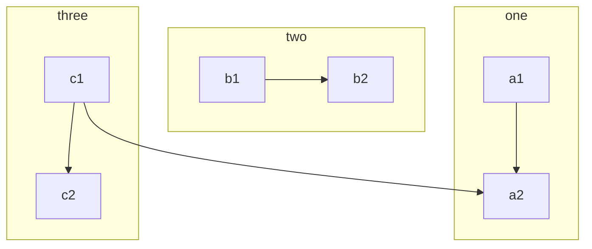

# Flowchart Syntax Guide

## Basic Shapes

```mermaid
graph TD
    id1[This is the text in the box]
    id2(This is the text in the circle)
    id3([This is the text in the stadium block])
    id4[[This is the text in the subroutine block]]
    id5[(Database)]
    id6((Circle))
    id7>Asymmetric shape]
    id8{Rhombus}
    id9{{Hexagon}}
    id10[/Parallelogram/]
    id11[\Parallelogram alt\]
    id12[/Trapezoid\]
    id13[\Trapezoid alt/]
```

## Styling
Apply CSS styles to nodes.

```mermaid
graph LR
    A:::someclass --> B
    classDef someclass fill:#f9f,stroke:#333,stroke-width:4px;
```

## Subgraphs
Group related nodes.

```mermaid
graph TB
    c1-->a2
    subgraph one
    a1-->a2
    end
    subgraph two
    b1-->b2
    end
    subgraph three
    c1-->c2
    end
```

